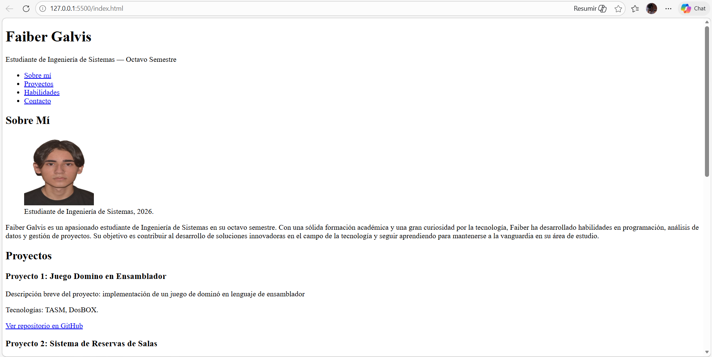

# Portafolio Web — Faiber Galvis
## Descripción
Página de portafolio personal desarrollada como laboratorio de la
Unidad 2 del curso de Programación Web. Implementa la estructura
semántica completa de HTML5 incluyendo etiquetas de sección, listas,
imágenes accesibles y meta tags de SEO.
## Tecnologías
- HTML5 (semántico)
## Cómo visualizar el proyecto
1. Clonar el repositorio: `git clone https://github.com/ZlatkovIDK/galvis-post1-u2.git`
2. Abrir la carpeta en Visual Studio Code
3. Hacer clic derecho en `index.html` → "Open with Live Server"
4. El navegador abre automáticamente en `http://localhost:5500`
## Capturas de pantalla
